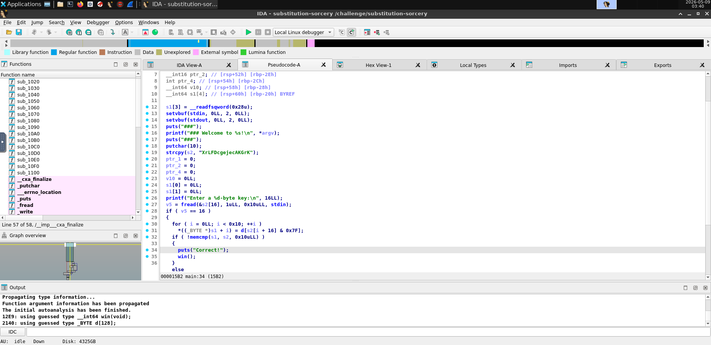
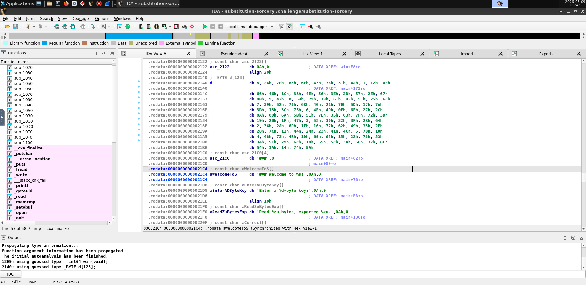

so this binary replace our input character-by-character with a character table
the "&7F" part just ensure that the expected input chars are <=7F, neat but irrelevant



so now we just need to look at this table, and reverse the key, slowly, very slowly
the key is "4942610d5d40166b3b6b406068474268", just load it into a python script and we're good to go

```
import sys
payload=bytes.fromhex("4942610d5d40166b3b6b406068474268")
sys.stdout.buffer.write(payload)
```
